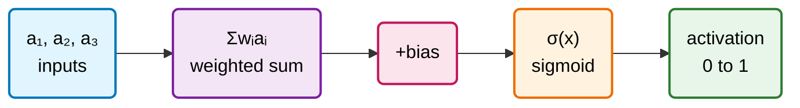
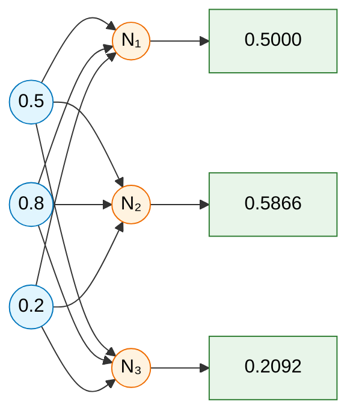
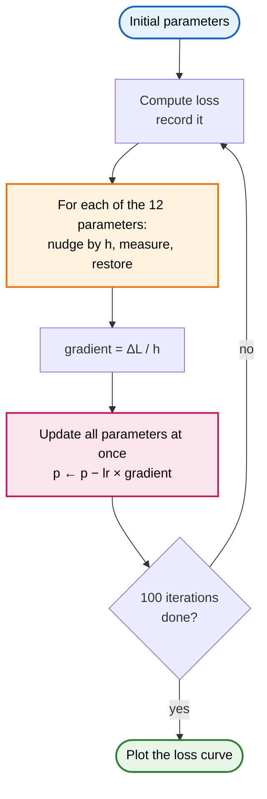

<div align="center">

# YZ50

**Training Türkiye's AI researchers from scratch.**


</div>

---

## What is YZ50?

YZ50 is a 12-week intensive program that turns 50 selected young people in Türkiye from *users* of AI into researchers who write, train, measure and improve models from scratch. The backbone of the program is Andrej Karpathy's **Zero to Hero** curriculum.

The thesis is simple: **a researcher must build a model from scratch in order to truly understand it.** Participants do not just watch videos — every week produces a working system, an experiment note, and a short technical presentation.

Over the 12 weeks, participants write a neural network from its very first line, build backpropagation by hand, train a language model, construct a transformer architecture, and finish with their own small working GPT.

**Weekly deliverables:**

| Deliverable | Description |
|---|---|
| GitHub code submission | All code written personally — AI assistance only for conceptual understanding |
| Experiment note | Loss, accuracy, sample quality and training behaviour |
| 3-slide progress presentation | Short technical demo for the Friday research meeting |

---

## Curriculum

<details>
<summary><b>Phase 1 · See and Understand</b> — weeks 1–4</summary>

<br>

*The participant learns how the basic mechanism of a neural network works. The goal is to understand what PyTorch does before using PyTorch.*

<details>
<summary><b>Week 1 — What Is a Neural Network</b></summary>

**Content**
- Neuron, layer, parameter and loss concepts
- Forward pass logic
- What it means for a model to learn
- Gradient descent intuition
- Introduction to the language model idea

**Exercise**
- Write a single-neuron forward pass in Python
- Build a simple loss function
- Manually change a parameter and observe how the loss changes

**Output**
- Simple neuron simulation
- 1-page technical note: how does a model learn

</details>

<details>
<summary><b>Week 2 — micrograd and Automatic Differentiation</b></summary>

**Content**
- Computation graph
- Derivative and chain rule
- Backpropagation
- Scalar autograd
- Karpathy's micrograd approach

**Exercise**
- Write the `Value` object from scratch
- Build the backward pass with topological sort
- Support addition, multiplication, tanh and power operations
- Train a small MLP

**Checkpoint 1:** working mini autograd engine, MLP trained on a small dataset

</details>

<details>
<summary><b>Week 3 — PyTorch Fundamentals</b></summary>

**Content**
- Tensor logic
- Broadcasting
- Matrix multiplication
- Autograd
- `loss.backward()`
- Minibatch training

**Exercise**
- Rewrite the micrograd model in PyTorch
- Train the same model with manual gradients and with PyTorch autograd
- Compare the results

**Output**
- PyTorch MLP
- micrograd vs. PyTorch comparison note

</details>

<details>
<summary><b>Week 4 — makemore and Language Modeling</b></summary>

**Content**
- Character-level language modeling
- Bigram model
- Negative log likelihood
- Sampling
- Train / dev / test split
- Smoothing and regularization

**Exercise**
- Train a bigram model on a names dataset
- Build a counting-based model
- Build a neural bigram model
- Compare train, dev and test loss

**Checkpoint 2:** working character-level language model, a model that samples, loss report

</details>

</details>

<details>
<summary><b>Phase 2 · Build and Train</b> — weeks 5–8</summary>

<br>

*The participant builds a more serious neural language model. The goal is not just a working model, but a healthily trained one.*

<details>
<summary><b>Week 5 — Embeddings and MLP Language Model</b></summary>

**Content**
- Embedding lookup
- Context window
- Hidden layer
- Cross entropy
- Learning rate tuning
- Overfitting and underfitting

**Exercise**
- Write the makemore MLP model
- Change the embedding dimension
- Change the hidden layer size
- Run a learning rate sweep
- Find the best validation loss

**Output**
- MLP language model
- Hyperparameter experiment table

</details>

<details>
<summary><b>Week 6 — Training Mechanics and Debugging</b></summary>

**Content**
- Initialization
- Activation statistics
- Gradient statistics
- Saturated tanh problem
- Kaiming initialization
- BatchNorm
- Update-to-data ratio

**Exercise**
- Break the model with bad initialization
- Plot activation and gradient histograms
- Add BatchNorm
- Compare training behaviour before and after

**Output**
- Training diagnostics report
- Model health check plots

</details>

<details>
<summary><b>Week 7 — Backprop Ninja</b></summary>

**Content**
- Tensor-level backpropagation
- Cross entropy backward
- Linear layer backward
- BatchNorm backward
- Embedding backward
- Computing gradients without autograd

**Exercise**
- Write the backward pass with PyTorch autograd disabled
- Compare manual gradients against PyTorch gradients
- Measure the maximum difference

**Checkpoint 3:** MLP with manual backprop, gradient verification report

</details>

<details>
<summary><b>Week 8 — WaveNet and Deep Architecture</b></summary>

**Content**
- Using longer context
- Hierarchical architecture
- `torch.nn.Module`
- Layer, container and model organization
- Tensor shape debugging
- The basic convolution idea

**Exercise**
- Move the MLP model to a deeper structure
- Build a WaveNet-like model
- Increase the context size
- Compare the change in loss

**Output**
- Deeper language model
- MLP vs. WaveNet comparison

</details>

</details>

<details>
<summary><b>Phase 3 · Transformer, GPT and Capstone</b> — weeks 9–12</summary>

<br>

*The participant moves on to modern LLM architecture. The goal is not to use GPT as a black box, but to write a small working GPT from scratch.*

> Week-by-week detail to be filled in as the phase opens.

</details>

---

# Weekly Progress

---

## Week 1 — What Is a Neural Network

Five tasks in pure Python, no NumPy: a single neuron, a layer of neurons, a loss function, a manually swept loss curve, and a gradient descent loop driven by numerical derivatives.

<details>
<summary><b>Show full write-up, diagrams and plots</b></summary>

<br>

The whole week was written in **pure Python**. No NumPy, no framework — every sum, every sigmoid, every derivative is written by hand. `matplotlib` is used only to draw the plots.

### The neuron

Everything in this week reduces to one expression:



**a = σ(w₁a₁ + w₂a₂ + ... + wₙaₙ + b)**

**σ(x) = 1 / (1 + e⁻ˣ)**

The **weights** encode *which pattern* the neuron is looking for. The **bias** encodes *how high* the weighted sum has to get before the neuron starts to fire. The **sigmoid** squashes the whole real line into the 0–1 range so the output can be read as an activation.

### Tasks

| # | File | What it does | Output |
|:-:|------|--------------|--------|
| 1 | `single_neuron.py` | Forward pass of one neuron | `0.5` |
| 2 | `multi_neuron.py` | A layer of neurons over the same inputs | 3 activations |
| 3 | `loss.py` | Sum of squared errors against a target | `0.6379` |
| 4 | `forward_and_loss.py` | Sweeps one weight, plots loss against it | loss curves |
| 5 | `decreasing_loss.py` | Numerical-derivative gradient descent | descent curves |

---

<details>
<summary><h3>Task 1 — Single neuron forward pass</h3></summary>

Multiplies each input by its weight, sums them, adds the bias, and pushes the result through the sigmoid.

**Fixed test values**

```python
prev_activations = [0.5, 0.8, 0.2]
weights          = [0.4, -0.6, 0.9]
bias             = 0.1
```

| Stage | Value |
|---|---|
| Weighted sum | `-0.1` |
| After bias | `0.0` |
| After sigmoid | `0.5` |

A weighted sum of exactly `0` lands on the midpoint of the sigmoid, which makes `0.5` a convenient reference point for checking that the function is wired correctly.

**Findings**

- `math.exp` is **asymmetric**: it raises `OverflowError` on large positive input, but silently returns `0.0` on large negative input. Writing the sigmoid as `1/(1 + exp(-x))` protects the positive side; the negative side can still overflow. Stress-testing with `bias = -20` is enough to see saturation without blowing up — `bias = -1000` just crashes.
- Floating point leaves residue. `0.4`, `0.6`, `0.9` are not exactly representable in binary, so the weighted sum came out as `-0.09999999999999995` rather than `-0.1`. Compute at full precision, format only at display time with `:.4f`.

</details>

---

<details>
<summary><h3>Task 2 — Multi-neuron layer</h3></summary>

Same operation, repeated for every neuron in the layer. The inputs stay the same; each neuron has its own weight list and its own bias.



The weights become a list of lists — one row per neuron:

```python
weights = [
    [0.4, -0.6,  0.9],
    [0.1,  0.7, -0.3],
    [0.6, -1.3,  0.8],
]
biases  = [0.1, -0.2, -0.75]
```

**Findings**

- The **outer loop runs over neurons, not inputs.** The inputs are shared by every neuron, so looping over them gives you nothing; the number of outputs equals the number of neurons, and that is what the outer loop has to produce.
- Loop bounds should come from `len(weights)`, not a hardcoded count, so adding a fourth neuron requires no code change.
- The neuron function takes everything it needs as **parameters** rather than reading globals. This matters later: Task 5 calls the same function repeatedly with perturbed values, and a function bound to globals makes that awkward.

</details>

---

<details>
<summary><h3>Task 3 — Loss function</h3></summary>

Measures how far the network's output is from the target, as a sum of squared differences.

$$L = \sum_{i} (\text{output}_i - \text{target}_i)^2$$

Squaring does two things: it removes the sign, so an error of `+0.3` and `-0.3` cost the same, and it punishes large errors disproportionately, so the network is pulled towards fixing the big mistakes first.

| Outputs | Targets | Loss |
|---|---|---|
| `[0.5000, 0.5866, 0.2092]` | `[1.0, 0.0, 0.0]` | `0.6379` |

**Findings**

- **Changing the target is not learning.** Swapping the target to `[0.0, 1.0, 0.0]` dropped the loss to ~0.4, but the network was untouched — the target had simply been moved closer to what the network already said. Only changing the *parameters* improves the model.
- The loss is a function of the **parameters**, not of the output. The inputs and targets are fixed data; the 12 numbers in `weights` and `biases` are the only things that can move. This framing is what makes gradient descent possible.

</details>

---

<details>
<summary><h3>Task 4 — Manual parameter sweep</h3></summary>

One weight is swept across a range while everything else is held fixed, and the loss is recorded at each step. The point is to *see* the surface that gradient descent will later walk down.

<div align="center">

| Narrow range | Wide range |
|:---:|:---:|
|  |  |

</div>

**Findings**

> **The curve is a plateau, not a valley.**
> In this single-layer network each weight feeds exactly one neuron. As the weight grows, the sigmoid saturates, the activation sticks to 0 or 1, and the loss flattens out instead of turning back up. A parabola would require conflicting pressures on the same parameter — which a single layer with one training example does not produce.

> **The height of the plateau is the residue from the other neurons.**
> `weights[0][0]` only affects neuron 1. The contributions of neurons 2 and 3 (`0.3441 + 0.0437 ≈ 0.39`) stay constant no matter what that weight does — and `0.39` is exactly where the curve flattens.

> **The direction of the slope follows the target.**
> Sweeping other weights gave plateaus too, but tilted the other way. For a neuron whose target is `1.0`, raising the weight lowers the loss; for a neuron whose target is `0.0`, raising the weight raises it.

**A note on saturation:** in the flat region the slope is effectively zero, so gradient descent will barely move there. This is a small, visible instance of the vanishing gradient problem.

</details>

---

<details>
<summary><h3>Task 5 — Gradient descent with numerical derivatives</h3></summary>

The gradient of each of the 12 parameters is estimated by brute force — nudge it, measure the change in loss, put it back:

$$\frac{\partial L}{\partial p} \approx \frac{L(p + h) - L(p)}{h} \qquad h = 10^{-4}$$



Two details that decide whether this works at all:

1. **Restore the parameter after measuring it.** Otherwise the next parameter's gradient is measured on an already-damaged network.
2. **Collect all gradients before applying any of them.** Every gradient has to be measured from the *same* starting point. Updating as you go means later measurements refer to a network that has already moved.

### Learning rate comparison

<div align="center">

| `lr = 0.1` | `lr = 0.5` | `lr = 5.0` |
|:---:|:---:|:---:|
|  |  |  |

</div>

**Findings**

> **Loss fell from `0.638` to roughly `0.02` over 100 iterations.**
> The starting value matches the hand-computed Task 3 loss exactly, confirming the loop begins from an untouched network.

> **Fast at first, then slow — by design, not by accident.**
> Early on the slope is steep and the steps are large; as the minimum approaches the slope flattens and the steps shrink on their own. The step size is proportional to the gradient, so the algorithm decelerates without being told to.

> **It never reaches zero.**
> The sigmoid never outputs exactly 0 or 1, so the targets are unreachable in principle. This is the same saturation seen as a plateau in Task 4, viewed from a different angle.

**Why nobody trains real networks this way:** every gradient step here costs 12 extra forward passes. With the ~13,000 parameters of a small MNIST network it would cost 13,000 per step. Backpropagation computes the same gradients in a single backward pass — which is Week 2.

</details>
</details>

---

## Running the code

```bash
python "WEEK 1/single_neuron.py"
python "WEEK 1/multi_neuron.py"
python "WEEK 1/loss.py"
python "WEEK 1/forward_and_loss.py"
python "WEEK 1/decreasing_loss.py"
```

All input values are hardcoded, so no arguments are needed. Only `matplotlib` is required, and only for tasks 4 and 5:

```bash
pip install matplotlib
```

---

## References

**Videos**

- 3Blue1Brown — [But what *is* a neural network?](https://www.youtube.com/watch?v=aircAruvnKk) *(Deep Learning, chapter 1)*
- 3Blue1Brown — [Gradient descent, how neural networks learn](https://www.youtube.com/watch?v=IHZwWFHWa-w) *(Deep Learning, chapter 2)*
- Andrej Karpathy — [Neural Networks: Zero to Hero](https://www.youtube.com/playlist?list=PLAqhIrjkxbuWI23v9cThsA9GvCAUhRvKZ)

**Program**

- [YZ50 curriculum](https://yz50.ai/#mufredat)

---

<div align="center">

### Found this useful?

⭐ **Star the repo** to follow along week by week.


<br>

[](https://linkedin.com/in/beratkayalik)

<br>

*11 weeks to go.*

</div>
